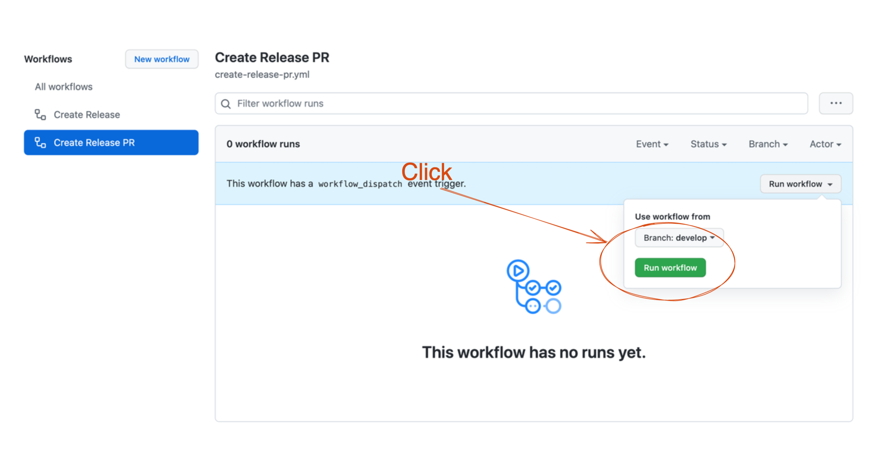
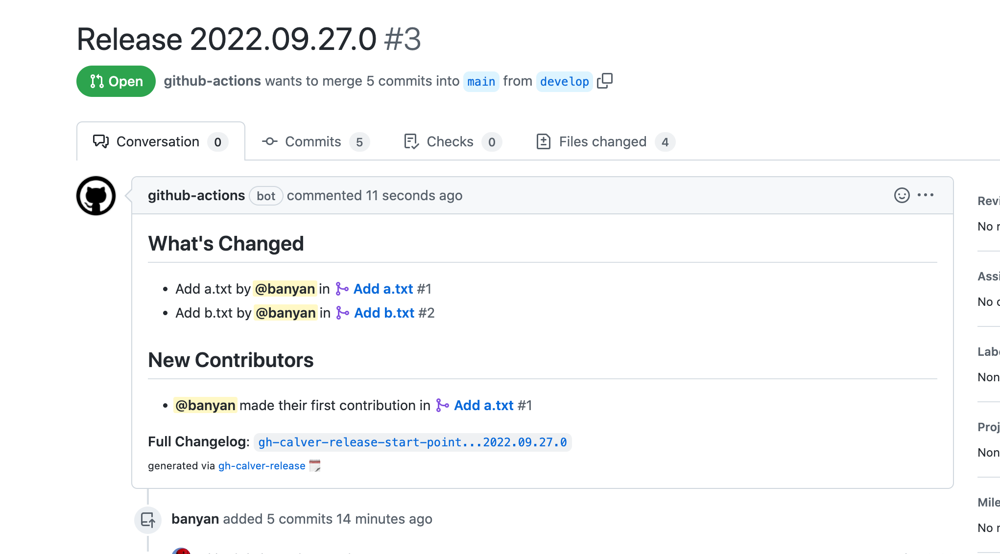
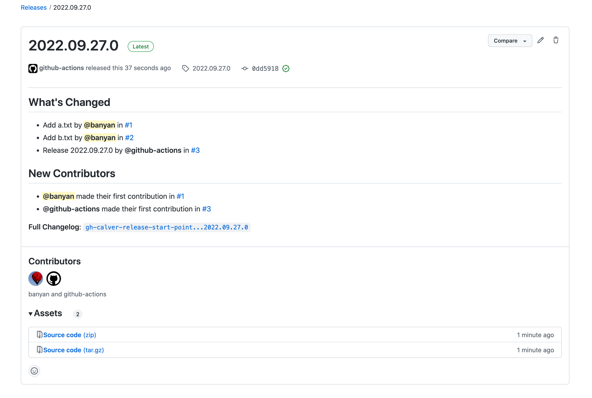

# gh-calver-release :spiral_calendar:

>Create a Release PR and a Release using calver

There are cases where you want to release a website or application with [calendar versioning](https://calver.org/).
This tool can be used in such cases and is supposed to be used with GitHub Actions.

You can run `gh-calver-release create:pr` on any event such as `workflow_dispatch`. This will create a pull request for release. The description of the Pull Request will be created using the [Automatically generated release notes](https://docs.github.com/en//repositories/releasing-projects-on-github/automatically-generated-release-notes) feature. You can also customize the description using `.github/release.yml`. See further [configuration options](https://docs.github.com/en//repositories/releasing-projects-on-github/automatically-generated-release-notes#configuration-options).





The `gh-calver-release create:release` is executed when the release PR is merged. In fact, releases are also created when a hotfix enters the base branch directly. This command will create a release with the tag of calendar versioning.



## Usage

### `gh-calver-release create:pr`

Create a file named `.github/workflows/create-release-pr.yml`. (You can change the file name if you like.)

```yml
name: Create Release PR
on:
  workflow_dispatch:

jobs:
  build:
    runs-on: ubuntu-latest
    timeout-minutes: 5
    steps:
    - name: Create release pull request
      run: |
        npx gh-calver-release create:pr --repo ${{ github.repository }} --base main --head develop
      env:
        GITHUB_TOKEN: ${{ secrets.GITHUB_TOKEN }}
```

```bash
$ gh-calver-release create:pr --help
gh-calver-release create:pr

Create release pull request

Options:
      --repo     The name of the owner and repository. The name is not case sensitive. (e.g. owner/repo)  [string] [required]
      --base     The name of the branch you want the changes pulled into. This should be an existing branch on the current repository.  [string] [required]
      --head     The name of the branch where your changes are implemented.  [string] [required]
      --format   Pick favorite format from https://github.com/muratgozel/node-calver#choose-format. The default is "yyyy.0m.0d.minor".  [string]
      --level    If the format has been changed, the level must also be changed to the appropriate one. The default is "calendar.minor".  [string]
  -h, --help     Show help  [boolean]
  -v, --version  Show version number  [boolean]

Examples:
  gh-calver-release create:pr --repo "banyan/gh-calver-release" --base "main" --head "develop"                                                       Specify only required argument usage
  gh-calver-release create:pr --repo "banyan/gh-calver-release" --base "main" --head "develop" --format "yyyy.0m.0d.minor" --level "calendar.minor"  Specify additional format and level usage
```

### `gh-calver-release create:release`

Create a file named `.github/workflows/create-release.yml`. (You can change the file name if you like.)

```yml
name: Create Release
on:
  pull_request:
    branches:
      - main # base branch
    types:
      - closed

jobs:
  build:
    runs-on: ubuntu-latest
    timeout-minutes: 5
    if: github.event.pull_request.merged == true # detect when pull request is merged
    steps:
    - name: Create release
      run: |
        npx gh-calver-release create:release --repo ${{ github.repository }} --target_commitish main --pull_number ${{ github.event.pull_request.number }}
      env:
        GITHUB_TOKEN: ${{ secrets.GITHUB_TOKEN }}
```

```bash
$ gh-calver-release create:release --help
gh-calver-release create:release

Create release

Options:
      --repo              The name of the owner and repository. The name is not case sensitive.  [string] [required]
      --target_commitish  Specifies the commitish value that determines where the Git tag is created from. Can be any branch or commit SHA. Unused if the Git tag already exists.  [string] [required]
      --pull_number       The number that identifies the pull request.  [number] [required]
      --format            Pick favorite format from https://github.com/muratgozel/node-calver#choose-format. The default is "yyyy.0m.0d.minor".  [string]
      --level             If the format has been changed, the level must also be changed to the appropriate one. The default is "calendar.minor".  [string]
  -h, --help              Show help  [boolean]
  -v, --version           Show version number  [boolean]

Examples:
  gh-calver-release create:release --repo "banyan/gh-calver-release" --target_commitish "main" --pull_number 1                                                        Specify only required argument usage
  gh-calver-release create:release  --repo "banyan/gh-calver-release" --target_commitish "main" --pull_number 1 --format "yyyy.0m.0d.minor" --level "calendar.minor"  Specify additional format and level usage
```

## Example

https://github.com/banyan/gh-calver-release-example

- Release PR: https://github.com/banyan/gh-calver-release-example/pull/3
- Release: https://github.com/banyan/gh-calver-release-example/releases/tag/2022.09.27.0
